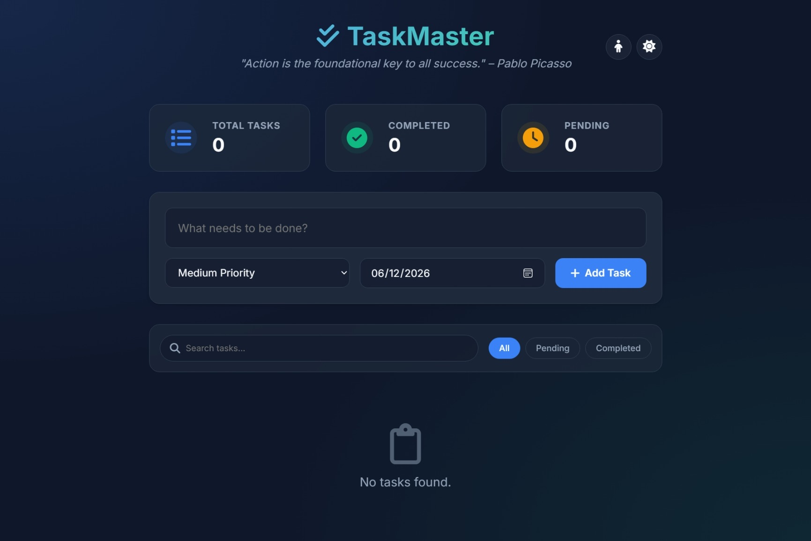
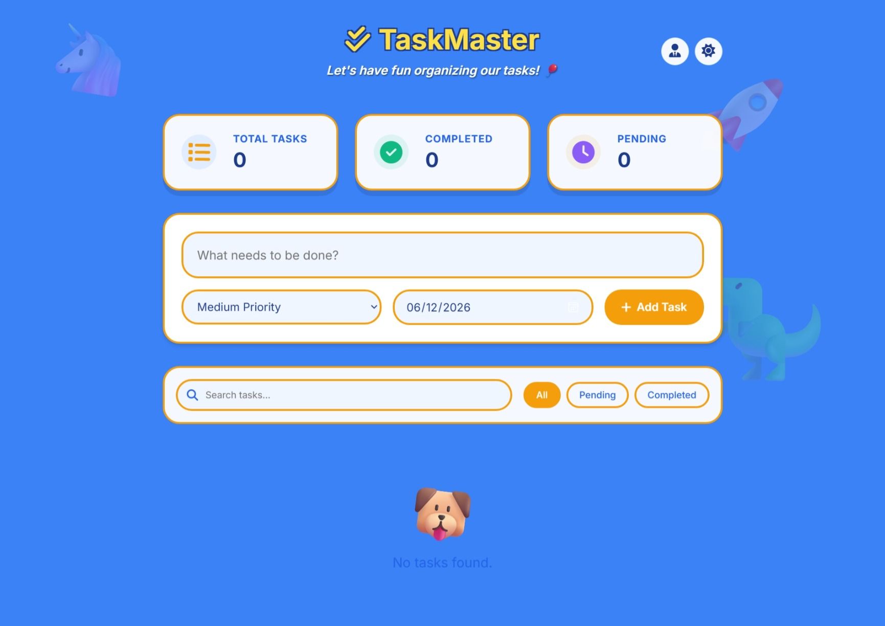

# TaskMaster Pro - To-Do List Web App

## 1. Project Overview
TaskMaster Pro is a feature-rich, beautifully designed To-Do List web application built to help users manage their daily tasks effortlessly. Unlike traditional to-do lists, TaskMaster Pro caters to both adults and children by offering two entirely distinct visual modes: a sleek, professional "Adult Mode" and a fun, animated "Kids Mode". The application ensures a seamless user experience with local storage persistence, responsive design, and dynamic theme switching.

## 2. Features
- **Add Tasks**: Quickly add tasks with descriptions, priority levels, and due dates.
- **Delete Tasks**: Remove unwanted tasks with smooth exit animations.
- **Complete Tasks**: Check off tasks to mark them as completed.
- **Task Statistics**: Real-time tracking of Total, Completed, and Pending tasks.
- **Search Tasks**: Instantly find specific tasks using the built-in search bar.
- **Filter Tasks**: Filter tasks by All, Pending, or Completed states.
- **localStorage Persistence**: Your data is saved locally in your browser. It automatically restores your tasks, theme preference, and app mode when you return. Adult and Kids modes maintain completely separate, independent task lists!
- **Dark & Light Mode**: Switch between a sleek dark theme and a vibrant light theme seamlessly.
- **Adult Mode & Kids Mode Switching**:
  - **Adult Mode**: Professional, minimalist design with motivational quotes.
  - **Kids Mode**: Playful, bubbly UI featuring the "Fredoka" font, bouncing cartoon character decorations (🦄, 🦖, 🚀), gold star checkboxes, and fun celebration animations when tasks are completed.

## 3. Technologies Used
- **HTML5**: Semantic structure and accessible elements.
- **CSS3**: Modern styling, Flexbox/Grid layouts, CSS variables for theming, and custom keyframe animations.
- **JavaScript (ES6+)**: Core application logic, DOM manipulation, state management, and dynamic rendering.
- **localStorage API**: Persistent browser storage.
- **Google Fonts & FontAwesome**: Beautiful typography (Inter & Fredoka) and scalable vector icons.

## 4. Project Structure
```text
To_do_list/
├── index.html       # The main HTML document
├── style.css        # All styling, animations, and theme overrides
├── script.js        # Core logic, local storage handling, and event listeners
├── screenshots/     # Contains project screenshots
└── README.md        # Project documentation
```

## 5. Screenshots

### Adult Mode


### Kids Mode


## 6. Installation and Usage

TaskMaster Pro requires no server setup or installations!

1. Clone or download this repository to your local machine.
2. Open the project folder.
3. Double-click on `index.html` to open it in any modern web browser (Chrome, Firefox, Safari, Edge).
4. **Usage Tips**:
   - Use the **Sun/Moon** icon in the top right to toggle between Light and Dark themes.
   - Use the **Child/Tie** icon to switch between Kids Mode and Adult Mode.
   - Watch out for the floating characters and celebration animations when completing a task in Kids Mode!

## 7. Future Improvements
- **Drag and Drop**: Reorder tasks manually using drag-and-drop mechanics.
- **Category Tags**: Support for custom tags (e.g., Work, Personal, Groceries).
- **Cloud Sync**: Optional integration with Firebase or backend servers to sync tasks across multiple devices.
- **Due Date Reminders**: Push notifications or browser alerts for tasks that are approaching their due dates.
